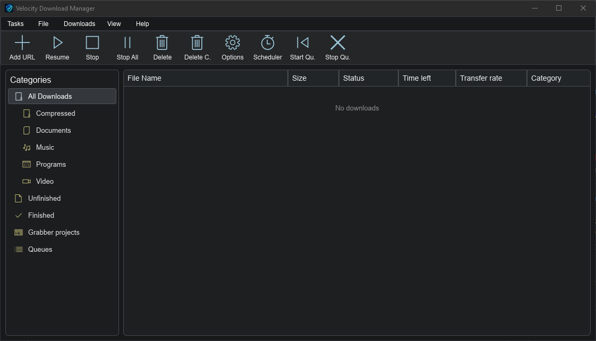
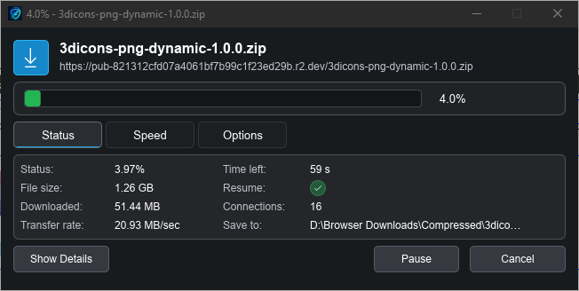
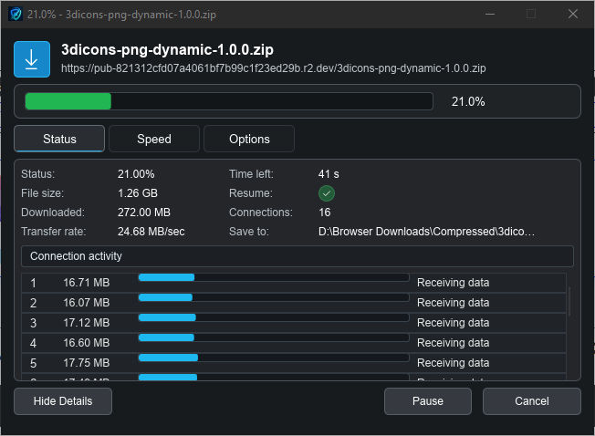

# Velocity Download Manager

Velocity Download Manager is a Windows-focused native download manager built with Rust and Slint. Version 2.0 moves the app away from the old webview/React UI and into a native Slint interface for a lighter, faster IDM-style desktop workflow.

Download Windows Installer: https://github.com/hasi98/Velocity-Downloader/releases/latest

## Highlights

- Native Rust + Slint desktop UI with no React/webview frontend.
- Multi-connection segmented downloads with pause, resume, stop, retry, and queue support.
- YouTube and media downloads through bundled `yt-dlp`.
- FFmpeg is downloaded on demand only when media merging is needed.
- Browser extension integration for Chromium browsers.
- Persistent download history and restart recovery.
- Scheduler and batch queue tools.
- Tray icon with hide-on-close behavior.
- SHA256-verified update checks through GitHub Releases.

## Screenshots

### Main Window



### Download Progress



### Connection Details



## Features

### Download Engine

- Segmented downloads with configurable connections per file.
- Global connection cap to avoid too many simultaneous network streams.
- Single-stream fallback for servers that do not support ranges.
- Pause, resume, stop, redownload, retry-ready state, and remove.
- Per-download speed limiter and global speed limiter.
- Duplicate filename handling such as `file (1).zip`.
- Temporary segment files are cleaned after successful assembly.
- `.meta` files are used to restore incomplete downloads after restart.

### Media Downloads

- YouTube/video URL analysis using `yt-dlp`.
- Quality picker with available resolutions/codecs.
- Selected quality is passed to `yt-dlp` with audio merge fallback.
- Real-time `yt-dlp` progress is shown in the main list.
- FFmpeg is fetched on demand for video/audio merging instead of being bundled into the installer.

### App UI

- Native IDM-style main window with categories and sortable download history.
- Separate Add Download, Batch Download, Scheduler, Options, File Properties, Download Progress, and Download Complete windows.
- Add Download window automatically analyzes pasted URLs.
- Download progress window supports compact mode and connection details.
- Download Complete window can open the file, open with Windows, or open the folder.
- Keyboard selection support in the history list, including arrows, Delete, Ctrl select, Shift select, and Ctrl+A.
- Right-click context menu for common file/download actions.

### Queues, Batch, and Scheduler

- Add single downloads to the scheduler queue.
- Batch downloads from pasted URLs or imported URL lists.
- Batch mode supports all-at-once or one-by-one.
- Scheduled batch downloads remember their selected mode.
- Scheduler starts only scheduled queued items, not normal paused downloads.
- Scheduler includes a queued-files tab.

### Browser Extension

- Manifest V3 extension for Chromium browsers such as Chrome, Edge, Brave, Opera, and Vivaldi-style browsers.
- Browser download interception with cookies, referer, and user-agent forwarding.
- "Download with VDM" context menu.
- Small video overlay button for supported video pages, with a close button.
- Browser fallback behavior when VDM cannot accept a download.

### Windows Integration

- App hides to system tray when the main window is closed.
- Tray menu includes Open, Add new download, Add new batch download, and Exit.
- Optional Start with Windows setting.
- Installer updates bundled extension files.
- App icon is used for titlebars, taskbar, tray, installer, and extension assets.

### Updates

- GitHub Releases based update checks.
- `latest.json` includes the release version, installer URL, and SHA256 hash.
- The app verifies the downloaded installer hash before running an update.

## Tech Stack

- Native UI: Slint
- Core downloader: Rust
- Packaging: Tauri bundler / NSIS
- Browser extension: Manifest V3 JavaScript
- Media engine: `yt-dlp` with optional FFmpeg
- Local app bridge: HTTP server on `127.0.0.1:41420`

## Requirements

- Windows 10/11
- Node.js LTS
- Rust stable toolchain
- Visual Studio Build Tools with the Windows MSVC toolchain

## Development

Clone the repository:

```bash
git clone https://github.com/hasi98/Velocity-Downloader.git
cd Velocity-Downloader/velocity-downloader
```

Install dependencies:

```bash
npm install
```

Run the native app in development mode:

```bash
cd src-tauri
cargo run --bin velocity-native
```

Check the Rust app:

```bash
cd src-tauri
cargo check --bin velocity-native
```

## Production Build

Create the Windows executable and installers:

```bash
npm run tauri -- build
```

Generate the update manifest after every release build:

```powershell
npm run updater:manifest
```

Build outputs are generated here:

- Standalone executable: `src-tauri/target/release/velocity-native.exe`
- NSIS installer: `src-tauri/target/release/bundle/nsis/Velocity Download Manager_2.0.0_x64-setup.exe`
- MSI installer: `src-tauri/target/release/bundle/msi/Velocity Download Manager_2.0.0_x64_en-US.msi`
- Updater manifest: `src-tauri/target/release/bundle/latest.json`

For GitHub Releases, upload the NSIS installer and `latest.json`. The app checks:

```text
https://github.com/hasi98/Velocity-Downloader/releases/latest/download/latest.json
```

## Browser Extension Installation

The extension files are installed with the app and are also available in the `extension` directory.

Manual installation:

1. Open your browser extensions page:
   - Chrome: `chrome://extensions`
   - Edge: `edge://extensions`
   - Brave: `brave://extensions`
2. Enable Developer mode.
3. Click Load unpacked.
4. Select the installed VDM extension folder or the repository `extension` folder.
5. Keep Velocity Download Manager running so the extension can send links to the local app.

## App Behavior

- Closing the main window hides the app to the tray instead of quitting.
- Use the tray menu to reopen the app or exit completely.
- Start with Windows can be enabled from Options.
- Completed downloads remain visible after restarting.
- Incomplete downloads are restored from `.meta` files when possible.
- Some sites require the browser extension because cookies, referer, and user-agent headers are needed.

## Project Structure

```text
velocity-downloader/
  bin/                    Bundled helper binaries such as yt-dlp
  extension/              Browser extension
  logo/                   Source logo assets
  scripts/                Release helper scripts
  src-tauri/              Rust native app, downloader, and installer config
  src-tauri/icons/        Generated app icons
  src-tauri/src/          Rust app source
  src-tauri/ui/           Slint UI files
```

## Notes

- Protected streaming, DRM, or blob-only media may not be downloadable.
- FFmpeg is required for some video/audio merges and is installed on demand.
- If Windows shows an old taskbar icon after updating, unpin the old app and pin the rebuilt executable again because Windows caches pinned icons.

## License

This project is licensed under the MIT License. See `LICENSE` for details.
